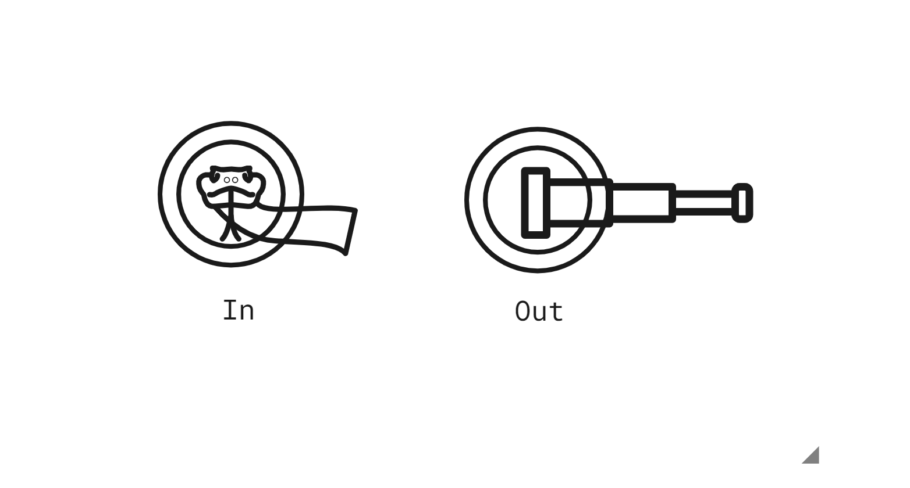

# UI/UX특강

### UX/UI 서비스 기획

콘텐츠 개발 - 프로세스 중 하나일 뿐

하루동안 사용하는 어플리케이션 갯수는?

단 몇시간만에 알람앱부터 시작해서 많은 앱을 쓴다.

앱,웹,it부분 그 뿐만이 아니다.

- UX - 사용자의 경험

경험을 토대로 서비스나 앱을 개발하는 것

사용자 경험이라 하면 ``문화만들기``의 하나이다.

결국, 기술을 통한 행복한 삶을 만들기 위해

기초적인 단계 - 앱 개발을 위한 ``기획``과 ``실행``

앱 컨셉 기획 - 와이어프레임 작성 - 프로토타입 제작 - GUI디자인

1. 문제찾고 조사하기

2. 생각을 구체화하기

3. 해결방안 찾기

4. 시각화하기

문화적으로, 사용자의 특성에 맞게 User Interface 를 구현하는것

★관심있는 SNS소개하기★

- 관심있는 문화를 돋보이게 하는 구성

UX -> UI넘어가는중

UX_UI사례

애플 밀어서잠금해제

와이파이 보급

하향식 구조 -> 상향식 구조

기술력? 있어도 못했을까

이통사의 갑질 횡포

문고리

루브르박물관 (파란조명)

마포대교(자살율1위)

무인자동차

데이터강국 - 미국,중국

표준집단이 많아서

토니스타크

잊지말아야 할 UX_UI의 세가지 요소

1. **<u>사용성과 기능성</u>**

컵의 용도

모양 - 광택, 원통형, 손잡이(뜨거운 것을 마시기위한)

재질 - 도자기

컵의용도가 바뀌었다면?

이 컵을 탄생당시의 용도와 다르게 사용하게 되었다면 컵 본연의 용도를 잊어버린것

★과거 물가자 귀해서 ``선택을 강요``받던 시대에서는 ``기능성``에 중심을 주었지만, 지금은 선택을 하는 사용자의 ``사용성``이 중요하다.★

도요타의 생산방식 - 소품종 대량생산방식

메타버스 적용방식

영화 - 메타버스라는 말이 없을때부터, 

2. **<u>피드백</u>**

액션 > 리액션 > 수정 

아프리카TV - 별풍선이 리액션이다.

현상의 이해

니즈의 변화파악

소비자 만족제고

-> 콘텐츠의 성공

3. **<u>의미의 전달</u>**

- 다양한 리서치과정을 통해 의미있는 정보를 캐내야 함
  - 숨어있는 정보를 찾기위해 다양한 리서치와 모델평가 진행

의미를 캐내는 과정은 스토리, 스토리텔링이 중요하다.

-> 서비스를 사용하는 사람을 감동시켜야 한다.

<u>**유머와 재미 감동**</u>으로 ``인간적인 감성``에 어필해야 한다.

- 문학의이해
  - 주장하기 위해서는 근거를 대지만 느낌을 전달하려면 인간성을 입증해야 한다.

# 프로젝트 : 문고리 디자인하기

1. 특별한 상황을 설정한다
2. 사용자의 행동을 인식한다
3. 적합한 디자인을 시행한다

- 유아가 자기 방이 생겼을 때 잠금장치에 호기심을 갖고 문을 잠글때
- 자꾸만 잠궈놓고 방문이 안열린다고 방에서 울고불고 난리
- 바깥에서 잠글 수 있는 잠금장치가 달려있는 문고리
- 잠금장치 핀이 나사처럼 돌리면 빠지는 형태로 되어있기 때문에 유아 방에는 그런 잠금장치를 사용하지 않고, 돌리는 잠금장치를 사용한다.

- 문이 닫혔을때 벽에 쿵 하지 않도록 방 안쪽 문고리에는 완충제가 덧대져 있다.

아이들 행동분석 - 여정맵

# 아이디어 도출하기

### 문화콘텐츠란?

文化

- 재미있는 ``문화``적인 요소를 ``디지털매체``를 통해 사람들에게 전달하여 ``상업적 이윤``을 창출하는것

워크래프트 - 게임회사 적극추천

"게임디자인 적극추천"

### 스마트 문화 콘텐츠?

스마트기기 + 문화콘텐츠

스마트홈 서비스 - IoT로 전력량 분석

샤오미의 가치 = 공유

샤오미를 통한 생활

특징 : 수평적 구조와 ``아이디어``가 핵심

### 콘셉트의 이해

- 목적을 이루기 위한 방향
- 어떤 작품이나 제품, 공연, 행사 따위에서 드러내려고 하는 주된 생각, 개념

### 스토리텔링 하기

``이야기``를 통한 ``감동``

-> 근거를 통한 당위성

### 스토리보드 시각화하기

