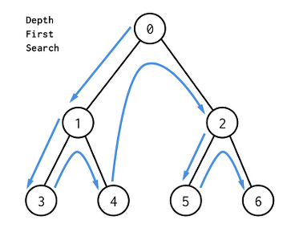

### 정렬알고리즘


| 정렬 알고리즘 | 평균 시간 복잡도 | 공간 복잡도 | 특징                                                         |
| ------------- | ---------------- | ----------- | ------------------------------------------------------------ |
| 선택 정렬     | 0(N²)            | 0(N)        | 아이디어가 매우 간단하다                                     |
| 삽입 정렬     | 0(N²)            | 0(N)        | 데이터가 거의 정렬되어 있을 때는 가장 빠르다                 |
| 퀵 정렬       | 0(NlogN)         | 0(N)        | 대부분의 경우 가장 적합하며, 충분히 빠르다                   |
| 계수 정렬     | 0(N+K)           | 0(N+K)      | 데이터의 크기가 한정되어 있는 경우 사용 가능하지만 매우 빠르게 동작한다 |

**표준 정렬 라이브러리는 최악의 경우에도 0(NlogN)을 보장하도록 설계 되어있다**


### 두 배열의 원소 교체

```python
n,k=map(int,input().split())  #N과 K 입력받기
a=list(map(int,input().split()))  #배열 A의 모든원소를 입력받기
b=list(map(int,input().split()))   #배열 B의 모든원소를 입력받기

a.sort()  #배열 A는 오름차순 정렬 수행
b.sort(reverse=True)  #배열 B는 내림차순 정렬 수행

#첫번째 인덱스부터 확인하며, 두 배열의 원소를 최대 K번 비교
for i in range(k):
    #A의 원소가 B의 원소보다 작은 경우
    if a[i]<b[i]:
        #두 원소를 교체
        a[i],b[i]=b[i],a[i]
    else:   #A의 원소가 B의 원소보다 크거나 같을 때, 반복문을 탈출
        break
        
print(sum(a))  #배열A의 모든 원소의 합을 출력
```


# DFS(Depth-First Search)

- ``깊이 우선 탐색`` 이라고 부르며 깊은부분을 우선적으로 탐색한다

- 스택 자료구조(혹은 재귀 함수) 이용

  - 탐색 시작 노드를 스택에 삽입, 방문처리

  - 스택의 맨 위에 방문하지 않은 인접 노드 발생 시, ``그 노드를 스택에 넣고 방문처리`` 한다

    (방문하지 않은 인접 노드가 없으면 ``스택에서 맨 위의 노드를 꺼낸다``)

  - 더 이상 위의 과정을 수행할 수 없을때까지 반복

(방문기준 : **<u>번호가 낮은 인접 노드</u>**부터)



**탐색순서 : 0 → 1 → 3 → 4 → 2 → 5 → 6**

```python
# DFS메서드 정의
def dfs(graph,v,visited):
    #현재 노드를 방문 처리
    visited[v]=True
    print(v,end=' ')
    #현재 노드와 연결된 다른 노드를 재귀적으로 방문
    for i in graph[v]:
        if not visited[i]:
            dfs(graph,i,visited)       
```

```python
#각 노드가 연결된 정보를 표현(2차원 리스트),인접리스트 방식으로 표현되어있다
graph=[
    [],
    [2,3,8],
    [1,7],
    [1,4,5],
    [3,5],
    [3,4],
    [7],
    [2,6,8],
    [1,7]
]

#각 노드가 방문된 정보를 표현(1차원 리스트),모든 노드를 아직 방문하지 않은것처럼 처리
visited=[False]*9   #하나 더 큰 수인 '9'로
#정의된 DFS함수 호출
dfs(graph,1,visited)
```


# BFS(Breadth-First Search)

- 너비 우선 탐색, 그래프에서 ``가까운 노드부터 우선탐색하는 알고리즘``
- ``큐 자료구조``를 이용
  - 탐색 시작 노드를 큐에 삽입하고 방문처리를 한다
  - 큐에서 노드를 꺼낸 뒤 해당 노드의 인접 노드 중에서 ``방문하지 않은 노드를 모두 큐에 삽입``하고 방문처리
  - 위의 과정을 수행할 수 없을 때까지 반복
- <u>인접노드를 한번에 넣는다.</u>
- <u>특정조건에서의 ``최단경로로 해결하기`` 위해 사용됨</u>


(<u>**방문기준 : 번호가 낮은 인접노드부터**</u>)


**탐색순서 : 0 → 1 → 2 → 3 → 5 → 4 → 6**


```python
from collections import deque

#BFS 메서드 정의
def bfs(graph,start,visited):
    #큐(Queue)구현을 위해 deque 라이브러리 사용
    queue=deque([start])
    #현재 노드를 방문 처리
    visited[start]=True
    #큐가 빌 때까지 반복
    while queue:
        #큐에서 하나의 원소를 뽑아 출력하기
        v=queue.popleft()
        print(v,end=' ')
        #아직 방문하지 않은 인접한 원소들을 큐에 삽입
        for i in graph[v]:
            if not visited[i]:
                queue.append(i)
                visited[i]=True
```

```python
#각 노드가 연결된 정보를 표현(2차원 리스트)
graph=[
    [], #0번노드는 비우기
    [2,3,8],
    [1,7],
    [1,4,5],
    [3,5],
    [3,4],
    [7],
    [2,6,8],
    [1,7]
]   #8개를 처리하도록 9개를 작성

#각 노드가 방문된 정보를 표현(1차원 리스트)
visited=[False]*9  
#정의된 BFS 함수 호출
bfs(graph,1,visited)
```


### 음료수 얼려먹기 문제

구멍이 뚫린 부분 : 0

칸막이가 존재하는 부분 : 1

얼음틀의 모양이 주어졌을 때 생성되는 총 아이스크림의 개수를 구하는 프로그램을 작성하라

``4X5의 틀 예시에서는 아이스크림이 총 3개 생성된다.``

|  0   |  0   |  1   |  1   |  0   |
| :--: | :--: | :--: | :--: | :--: |
|  0   |  0   |  0   |  1   |  1   |
|  1   |  1   |  1   |  1   |  1   |
|  0   |  0   |  0   |  0   |  0   |

연결요소 찾기


<입력조건>

- 첫번째 줄에 얼음 틀의 세로 길이 N과 가로길이 M이 주어집니다.(1<=N,M<=1000)
- 두번째 줄부터 N+1번째 줄까지 얼음 틀의 형태가 주어집니다.
- 이때 구멍이 뚫려있는 부분은 0, 그렇지 않은 부분은 1입니다.

<출력조건>

- 한 번에 만들 수 있는 아이스크림의 개수를 출력합니다.

입력예시   출력예시

4 5              3

00110

00011

11111

00000

<풀이>

- 얼음을 얼릴수 있는 공간을 상,하,좌,우로 연결하여 연결 수로 계산
- 특정지점 주변 상,하,좌,우 중 값이 '0'이면서 아직 방문하지 않은 지점을 방문
- 방문한 지점에서 다시 상,하,좌,우를 살펴보면서 방문을 진행하는 과정 반복 → 연결된 모든지점 방문
- 위의 과정 반복, 방문하지 않은 지점의 수를 카운트


```python
#DFS로 특정 노드를 방문하고 연결된 모든 노드들도 방문
def dfs(x,y):
    #주어진 범위를 벗어나는 경우에는 즉시 종료
    if x<=-1 or x>=n or y<=-1 or y>=m:
        return False
    #현재 노드를 아직 방문하지 않았다면
    if graph[x][y]==0:
        #해당 노드 방문 처리
        graph[x][y]=1
        #상,하,좌,우의 위치들도 모두 재귀적으로 호출
        dfs(x-1,y)
        dfs(x,y-1)
        dfs(x+1,y)
        dfs(x,y+1)
        return True
    return False

#N,M을 공백을 기준으로 구분하여 입력 받기
n,m=map(int,input().split())

#2차원 리스트의 맵 정보 입력 받기
graph=[]
for i in range(n):
    graph.append(list(map(int,input())))
    
#모든 노드(위치)에 대하여 음료수 채우기
result=0
for i in range(n):
    for j in range(m):
        #현재 위치에서 DFS 수행
        if dfs(i,j)==True:
            result+=1
            
print(result)    #정답출력
```

### 미로탈출

캐릭터의 좌표 : (1,1)

괴물이 있는 부분 : 0

괴물이 없는 부분 : 1

N,M(4≤N,M≤200) - 0 혹은 1의 미로의 정보가 주어짐

시작칸과 마지막칸은 항상 1

첫째 줄에 최소 이동 칸의 개수를 출력한다

입력예시     출력예시

5 6               10

101010

111111

000001

111111

111111

BFS는 최단거리 탐색 알고리즘

가까운 노드 > 차례대로 모든 노드 탐색

```python
#BFS 소스코드 구현
def bfs(x,y):
    #큐(Queue)구현을 위해 deque 라이브러리 사용
    queue=deque()
    queue.append((x,y))
    #큐가 빌 때까지 반복하기
    while queue:
        x,y=queue.popleft()
        #현재 위치에서 4가지 방향으로의 위치 확인
        for i in range(4):
            nx=x+dx[i]
            ny=y+dy[i]
            #미로 찾기 공간을 벗어난 경우 무시
            if nx<0 or nx>=n or ny>=m:
                continue
            #벽인경우 무시
            if graph[nx][ny]==0:
                continue
            #해당 노드를 처음 방문하는 경우에만 최단 거리 기록
            if graph[nx][ny]==1:
                graph[nx][ny]=graph[x][y]+1
                queue.append((nx,ny))
            #가장 오른쪽 아래까지의 최단 거리 반환
            return graph[n-1][m-1]
        
from collections import deque
        
#N,M을 공백을 기준으로 구분하여 입력 받기
n,m=map(int,input().split())
#2차원 리스트의 맵 정보 입력 받기
graph=[]
for i in range(n):
    graph.append(list(map(int,input())))
            
#이동할 네 가지 방향 정의(상,하,좌,우)
dx=[-1,1,0,0]
dy=[0,0,-1,1]

#BFS를 수행한 결과 출력
print(bfs(0,0))
```

