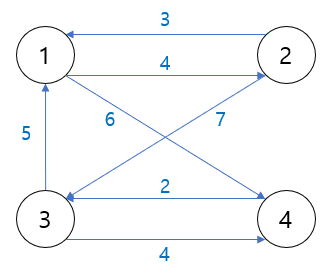

# 다익스트라 알고리즘

- 하나의 출발지에서 다른 모든 출발지까지 최단 경로 계산
- 최단경로 알고리즘 - 가장짧은 경로를 찾는 알고리즘
- 다익스트라 최단경로 알고리즘은 그리디 알고리즘으로 분류됨
  - 매 상황에서 가장 비용이 적은 노드 선택해 과정 반복


### 알고리즘 동작과정

1. 출발노드 설정
2. 최단 거리 테이블 초기화
3. 방문하지 않은 노드 중 최단 거리가 가장 짧은 노드 선택
4. 그 노드를 거쳐 다른 노드로 가는 비용을 계산하여 최단 거리 테이블 갱신
5. 위 과정에서 3,4 반복


```python
import sys
input=sys.stdin.readline
INF=int(le9)   #무한을 의미하는 값을 10억으로 설정

#노드의 개수, 간선의 개수 입력받기
n,m=map(int,input().split())
#시작 노드 번호를 입력받기
start=int(input())
#각 노드에 연결되어 있는 노드에 대한 정보를 담는 리스트를 만들기
graph=[[]for i in range(n+1)]
#방문한적이 있는지 체크하는 목적의 리스트를 만들기
visited=[False]*(n+1)
#최단 거리 테이블을 모두 무한으로 초기화
distance=[INF]*(n+1)

#모든 간선 정보를 입력받기
for _ in range(m);
a,b,c=map(int,input(),split())
#a번 노드에서 b번 노드로 가는 비용이 c라는 의미
graph[a].append((b,c))

#방문하지 않은 노드 중에서, 가장 최단 거리가 짧은 노드의 번호를 반환
def get_smallest_node():
    min_value=INF
    index=0  #가장 최단 거리가 짧은 노드(인덱스)
    for i in range(1,n+1):
        if distance[i]<min_value and not visited[i]:
            min_value=distance[i]
            index=i
    return index
def dijkstra(start):
    #시작 노드에 대해서 초기화
    distance[start]=0
    visited[start]=True
    for j in graph[start]:
        distance[j[0]]=j[1]
    #시작 노드를 제외한 전체 n-1개의 노드에 대해 반복
    for i in range(n-1):
        #현재 최단 거리가 가장 짧은 노드를 꺼내서, 방문처리
        now=get_smallest_node()
        visited[now]=True
        #현재 노드와 연결된 다른 노드를 확인
        for j in graph[now]:
            cost=distance[now]+j[1]
            #현재 노드를 거쳐서 다른 노드로 이동하는 거리가 더 짧은 경우
            if cost<distance[j[0]]:
                distance[j[0]]=cost
                
#다익스트라 알고리즘을 수행
dijkstra(start)

#모든 노드로 가기 위한 최단 거리를 출력
for i in range(1,n+1):
    #도달할 수 없는 경우, 무한(INFINITY)이라고 출력
    if distance[i]==INF:
    #도달할 수 있는 경우 거리를 출력
    else:
        print(distance[i])
```

- 개선된 구현방법

```python
import heapq
import sys
input=sys.stdin.readline
INF=int(le9)   #무한을 의미하는 값을 10억으로 설정

#노드의 개수, 간선의 개수 입력받기
n,m=map(int,input().split())
#시작 노드 번호를 입력받기
start=int(input())
#각 노드에 연결되어 있는 노드에 대한 정보를 담는 리스트를 만들기
graph=[[]for i in range(n+1)]
#방문한적이 있는지 체크하는 목적의 리스트를 만들기
visited=[False]*(n+1)
#최단 거리 테이블을 모두 무한으로 초기화
distance=[INF]*(n+1)

#모든 간선 정보를 입력받기
for _ in range(m);
a,b,c=map(int,input(),split())
#a번 노드에서 b번 노드로 가는 비용이 c라는 의미
graph[a].append((b,c))

def dijkstra(start):
    q=[]
    index=0  #가장 최단 거리가 짧은 노드(인덱스)
    for i in range(1,n+1):
        if distance[i]<min_value and not visited[i]:
            min_value=distance[i]
            index=i
    return index
def dijkstra(start):
    q=[]
    #시작노드로 가기 위한 최단 경로는 0으로 설정하여, 큐에 삽입
    heapq.heappush(q,(0,start))
    distance[start]=0
    while q:  #큐가 비어있지 않다면
        #가장 최단 거리가 짧은 노드에 대한 정보 꺼내기
        dist,now=heapq.heappop(q)
        #현재 노드가 이미 처리된 적이 있는 노드라면 무시
        if distance[now]<dist:
            continue
        #현재 노드와 연결된 다른 인접한 노드들을 확인
        for i in graph[now]:
            cost=dist+i[1]
            #현재 노드를 거쳐서, 다른 노드로 이동하는 거리가 더 짧은 경우
            if cost<distance[i[0]]:
                distance[i[0]]=cost
                heapq.heappush(q,(cost,i[0]))
                
#다익스트라 알고리즘을 수행
dijkstra(start)

#모든 노드로 가기 위한 최단 거리를 출력
for i in range(1,n+1):
    #도달할 수 없는 경우, 무한(INFINITY)이라고 출력
    if distance[i]==INF:
    #도달할 수 있는 경우 거리를 출력
    else:
        print(distance[i])
```


### 우선순위 큐

- 우선순위가 가장 높은 데이터를 가장 먼저 삭제하는 자료구조

- 표준 라이브러리 형태로 지원(파이썬, C++, 자바 포함 대부분의 프로그래밍 언어)

| 자료구조                    | 추출되는 데이터             |
| --------------------------- | --------------------------- |
| 스택(Stack)                 | 가장 나중에 삽입된 데이터   |
| 큐(Queue)                   | 가장 먼저 삽입된 데이터     |
| 우선순위 큐(Priority Queue) | 가장 우선순위가 높은 데이터 |

### 힙

- 최소힙 과 최대 힙이 있음
- 우선순위 큐를 구현하기 위해 사용하는 자료구조 중 하나

```python
import heapq

#오름차순 힙 정렬(Heap Sort)
def heapsort(iterable):
    h=[]
    result=[]
    #모든 원소를 차례대로 힙에 삽입
    for value in iterable:
        heatq.heappush(h,value)    #내림차순일 땐 heatq.heappush(h,-value)
    #힙에 삽입된 모든 원소를 차례대로 꺼내어 담기
    for i in range(len(h)):
        result.append(heapq.heappop(h))
    return result

result=heapsort([1,3,5,7,9,2,4,6,8,0])
print(result)
```


# 플로이드 워셜 알고리즘

- 모든 노드에서 다른 모든 노드까지의 최단 경로를 모두 계산한다.

- 2차원 테이블에 최단 거리 정보를 저장

- 거쳐가는 노드를 기준으로 알고리즘 수행

  - 다만 매 단계 방문하지 않은 노드 중 최단 거리를 갖는 노드를 찾는 과정이 필요하지 않다.




```python
INF=int(le9)   #무한을 의미하는 값으로 10억을 설정

#노드의 개수 및 간선의 개수를 입력받기
n=int(input())
m=int(input())
#2차원 리스트(그래프 표현)를 만들고, 무한으로 초기화
graph=[[INF]*(n+1)for _ in range(n+1)]

#자기자신에서 자기자신으로 가는 비용은 0으로 초기화
for a in range(1,n+1):
    for b in range(1,n+1):
        if a==b:
            graph[a][b]=0
            
#각 간선에 대한 정보를 입력받아, 그 값으로 초기화
for _ in range(m):
    #A에서 B로 가는 비용은 C라고 설정
    a,b,c=map(int,input().split())
    graph[a][b]=c
    
#점화식에 따라 플로이드 워셜 알고리즘을 수행
for k in range(1,n+1):
    for a in range(1.n+1):
        for b in range(1,n+1):
            graph[a][b]=min(graph[a][b],graph[a][k]+graph[k][b])
            
#수행된 결과를 출력
for a in range(1,n+1):
    for b in range(1,n+1):
        #도달할 수 없는 경우, 무한(INFINITY)이라고 출력
        if graph[a][b]==INF:
            print("INFINITY",end=" ")
        #도달할 수 있는 경우 거리를 출력
        else:
            print(graph[a][b],end=" ")
    print()
```

# 벨만 포드 알고리즘

### 다익스트라 알고리즘과 비교

- 다익스트라 알고리즘
  - 매번 방문하지 않은 노드 중에서 최단 거리가 가장 짧은 노드를 선택
  - 음수 간선이 없다면 최적의 해를 찾을 수 있다
- 벨만 포드 알고리즘
  - 매번 모든 간선 전부를 확인
    - 따라서 다익스트라 알고리즘에서 최적의 해를 항상 포함
  - 다익스트라 알고리즘에 비해 시간이 오래 걸리지만 음수 간선 순환을 탐지 할 수 있다


### 벨만 포드 알고리즘

```python
import sys
input=sys.stdin.readline
INF=int(le9)   #무한을 의미하는 값으로 10억을 설정

def bf(start):
    #시작 노드에 대해서 초기화
    dist[start]=0
    #전체 n번의 라운드(round)를 반복
    for i in range(n):
        #매 반복마다 "모든 간선"을 확인하며
        for j in range(m):
            cur=edges[j][0]
            next_node=edges[j][1]
            cost=edges[j][2]
            #현재 간선을 거쳐서 다른 노드로 이동하는 거리가 더 짧은 경우
            if dist[cur]!=INF and dist[next_node]>dist[cur]+cost:
                dist[next_node]=dist[cur]+cost
                #n번째 라운드에서도 값이 갱신된다면 음수 순환이 존재
                if i==n-1:
                    return True
     return False

#노드의 개수,간선의 개수를 입력받기
n,m=map(int,input().split())
#모든 간선에 대한 정보를 담는 리스트 만들기
deges=[]
#최단 거리 테이블을 모두 무한으로 초기화
dist=[INF]*(n+1)

#모든 간선 정보를 입력받기
for _ in range(m):
    a,b,c=map(int,input().split())
    #a번 노드에서 b번 노드로 가는 비용이 c라는 의미
    edges.append((a,b,c))
    
#벨만 포드 알고리즘을 수행
negative_cycle=bf(1)   #1번 노드가 시작 노드

if negative_cycle:
    print("-1")
else:
    #1번 노드를 제외한 다른 모든 노드로 가기 위한 최단 거리 출력
    for i in range(2,n+1):
        #도달 할 수 없는 경우, -1을 출력
        if dist[1]==INF:
            print("-1")
        #도달 할 수 있는 경우 거리를 출력
        else:
            print(dist[i])
```

