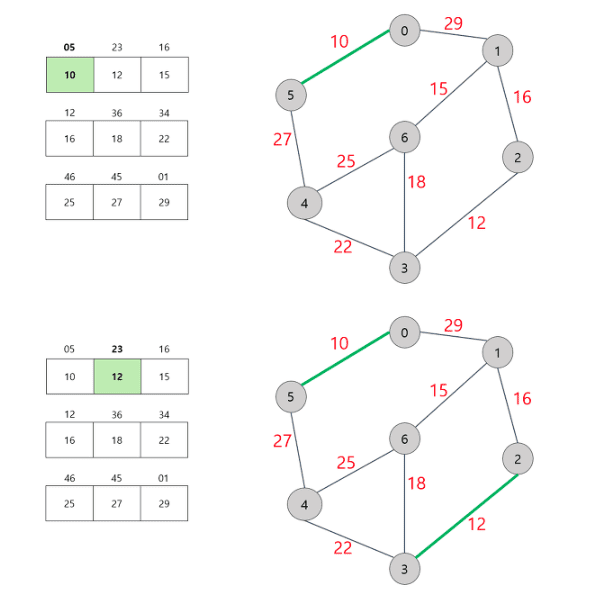
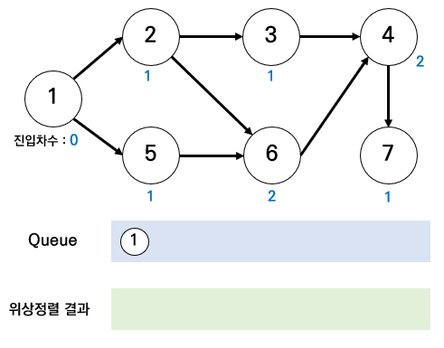

# 서로소 집합

- 공통원소가 없는 두집합을 의미함
- 서로소 부분 집합들로 나누어진 원소들의 데이터를 처리하기 위한 자료구조 : 서로소 집합 자료구조
  - ``합집합`` : 두개의 원소가 포함된 집합을 하나의 집합으로 합치는 연산
  - ``찾기`` : 특정 원소가 속한 집합이 어떤 집합인지 알려주는 연산
- ``서로소 집합 자료구조`` = ``합치기 찾기 자료구조`` 라고 불리기도 함


![알고리즘 공부 기록/강의8-108 January, 2021 서로소 집합 -서로소 집합(Disjoint Sets)란 공통 원소가 없는 두  집합을 의미한다. image 서로소 집합 자료구조란 서로소 부분 집합들로 나누어진 원소들의 데이터를 처리하기 위한 자료구조이다. 서로소  집합 자료구조는 ...](data:image/png;base64,iVBORw0KGgoAAAANSUhEUgAAAVoAAACSCAMAAAAzQ/IpAAABSlBMVEX///+P0enJycnNzc39///Hx8fOzs739/f7+/vf39/v7++NjY3BzdGM0OT5+fn19fXm5ubU1NSHh4fd3d2cnJyUlJS8vLy9vb18fHzk5OSqqqp1dXWxsbGkpKQAAACKiopsbGyxwMRbW1tmZmbr9vdXV1eHzOVGRkbj9fgpKSnF6PdQUFBCQkI1NTUgICAwMDAXFxd9yNkkJCQPDw/S8fPB6Ouv3uic1OHw/f+64+3a8fqp1+bh/Ptwxt6j3eR3ytYAm8ue3u0AltB3hod/gY3z69uVnql9bGOMhneQjoeIi5HJwbmxs6Pc18yttb1UUl2IfoSPw9FklbFol6dXh5qV0tk8YnmHsLpQaHhng4h7rsUuNEVKXmYyQ1dwn6VfV0s9VGdaeJVTdHkjKjMVJj9mfnyrnpRjkqFPeoiMxNl4q7tQZWCIyPI2RUprtVJOAAAWVklEQVR4nO1d+3/URpIvZkYzUivWo6XWs2Upo9hjYxviDcEGwr4ut3tJFm6B7Aa4vWyWu0vAe/f//3rVLc2MNKMZNNhgA/rywdaj1Or+dnV1VUlqA3To0KHDBjDUy67BB4TxTRu+gCDLQhYBHyfGr/DgaOdGMtxWgXGIXHAPxuMDS0qbnm15htwcKZVSeA/ALjYtR2WkPGz3wC8utEczWVM3NE/uWh4ZpUZ5uGerXnFdf16upYPtFd1tEdwpoTiqZy7Kgm96vKhEqGnaG7FxkYgoi43PgRCquNyOJ5l/kwOwBLYTpDZIBLWB21MUE0TDjG3HOSiu1Oi8FIWDfTgptr/A49m0dA55wakyHw4xEhYKYSMgN0GNp4dtGBdb3rzgHOzEzuXmoQJkestMa5ANTJsqktEoIuA6b8zJeWCM+XST8InW+xWw+GbP5WRfmWj7WFuXqdvZNpDtGybf5h5jTO9LrXS2gbvOEd2hsJMA1SfWOIsnkBlAooLyNEhh1q6AIMu6l9tIisNSQv2xZeF5GBV0kUzKSIxBDcxAGVsagz5jVqDsmHaCJ8JAnOYMB0ZWqvgBEClgDCPwXVfDTRhyGCZWUWqozrv33cLajmfb7rbF9mFfw36OgFKqHuJBNdjx1c/JF5qd80TTkVrXldLJjtCuzI0CuOk4X8C2xnP7SDajoDZiWeZL+yBwIBTN0xUFfx1AakUJtyVdsRzOJMBSWWExkNo+RwuUOHZkjHEv6DPiCaMj62q5UWRNu8HIwPeBooDimTnKZk4Arg2jYSKqyQNnclnUgjnbwvF/oN6AG0lCcw5KnuVH4rAXAmwbgMqNBsGL42A7FDuop7CPZ6wDxUT9DdRtyDljIHSQI7UqWpY4NiAaysKRgqgPwYgS3ycx7KBcDI6gk1goa1gwUYFa0lY4FJiGAhm4GrI/kdJoaIBCiLJhnzITe0TK2kz0DTIKFMnFThOySK0F5g7K+hzG6mVRO4dLQBl9jvNNX9NxGov1dEccRs0D1JBt7AVU55zSsQVCg5yceWDegCwj+wnJAwWOrGjHSmw8c+RbYuju5EJjAmn0gggNdAA6V1IjcH3cDDxkwTrKxnAIJnaL0NZc6mIcJUJDAyVyRwGzRxSyHvaNfZhlZobnEy5MrxwaapZEaKkhG7KIBLpGdMjsHgdfZw7SjrdNAPLLIXQBN+VPl0NyhL6AaCi7eXS0b8H+4dFRAOxwPN5ZPysEclR71gBUVR1wH5LBYJVsX9oWp7QZzIZkdbmenBR6xc3V1FKj1bKZ1OjSy5gOnA8ApLajqrCaWjw931bNlWJL5Y6MlWICBq/saB8Msx06dOiwiNX2tcO50aV3ZlBWeD52QppPSKw7J05iOIBO2EoJE6FWxBGG9BRCrdgg9ZOj0o0gmlkeUeWvdfcwqu7EaLRcbXNU3WtuUeHLVG+ztuV1jCP14OhANWs+kDMGsi9SBllRy3EQxDIPwjmEcTAm0h0PinuJk0ohBqDTGCMhBMbGQQRDDDYCDOzAKzJSbozCWEwSuSJ8dWIUzzCqi3lflE9SqtnChUKXGkNbWYEojn2lSMKQiGLUofIsVri4PNSZi6GMHgSBzNuU0XuO90hA8cvGREHmYelpcDCSNTbR/3WDQPd6RfVBzTNbRH54XW6Bh0F9XhQTG7pw1yMM9EWkghXSIXiNs1ilVosYJI6O7QiFMogrzfxXKuwIMmRkBqZbCtsukwRZkvIi3NFmap+OwWLYpEz4tLrr0gj8iBAZx/LCzSwbf+QyVrTc0uGwL9I5wwxb0Q/yvrNj+bEduGaYygtSrJFfCGtuHmFYDjoJeSAvdgW1cUiIVKaitlCkxxS9pyhFeoJpw4yI+lJRV7fIxWW+rFKQi+AiEx2MVCcOmJZFJtPmyfyGx7kn8mzWoX7oHtZ0fRlke5b5HDvaNgfr5pF2mE7gi2xfJkAxPJPUTohlWXNqASNKsIZpyTvSZmF7p7xHVDVz0J1MTGcHiu87oFDfk+ER55YVmlNqOdZWKrqGVc5N8FLoJaIHssC2I8JtR/NsmZ1FavHy3pFUei0gWYg6l2mWzGD2KN6EQMz9gvsDvEc4HU3q0LaHknGuQx85DfpAZfQdIzvcoAqTnRYDqqYcO4rM2GWeV+hzDr3gUBSAhYoMndAbOopfo7Xm5zOyxjYyt20lHp8kR8MjYQsQ+yW1XnQjijDA1PVUjknRXAfVfCwiTx7tRxwHMZ4UPGWiTSEbSitiekhfD5QsSVxhEKwop6gSHgpT4EwAy/dENSiIy21RBB2B4igWV3yF96bUYlvKwU0yL/MOVZi4ltTakHsedyBmbpGX62GFsId0rFAyQtMTBBmyWJRuxqiAcsxJauPQU1wD1AzvIPjEf45oCHaUi1WW3QyF1nJR0A4G2CM8v5lBcHvAosTzAkKdIxgW1JYGAaYZ5xIi6c8yP8qK3WoGhGT0iNkRd6mwS4nrHiQizTeaTkG8koRApeVy2Arb64IqSJC3S+mObgOqun8E1n4cM9SpPA700m46KBSouaZHglrCkjgWNMxvUqmQFZYbZlG6jbfKS2oNb8KjAAvTYnozIuOUV/NkOyAHvbi9NAiztIWDRdINqHXCG/n+yLvpTLID+HxHzl5wWFAbUXpAA66neppSQQ1hoOFoVUUdE3GSeroAlUaNghla5rR9OPhNKk+aYAU0j2mgpEKjXFQ7l80C/qJRfbmvBllf5Ho0a1w9idOYHOVJb2QaaihGTmFafNTIflko+EGKFUoSsU/7Ch+ZMydgWNwtkDN9MEJj4RBePPvBgk2sfVbUVfeojoVMB7WcxnJzVMzynm+YGziXwaRwKPA/FnNj2v3gb69LdbF1RRb1Ut3VEgG2YaYLhZwt7JtFiXjm4+GUTGsnh4XTY+MJXWyZVnGivzoJEwrZ6eM7u0izJVVi+vZypRfBxc0i8ZBFdJJ4JqBbq5u1Fvz1Ih06dOjQoUOHjwGGcEWF82UREQaamhqaDhgjQ7zSgT66GYI2dQ9JGIbofKjoo8u8UunLqLUMFPorwiUSuSmDTNNGoW3bs1eFxPXly0bifSMYqSPx4pLijQxblmmJm6jwnj/eIn4QeBhEB0riC9/OYw51XHvsJuiukygJ7Wj2EgbYnHsYa01cJj1+o/Db+7me0iLIvwlqnuQyhLMyxU8SiDJdn1gY0rqJfG7sH4hsQ8QnsrvGqp32zOQwgYDwIGYalQGHr5gHGFRejcfdbww7CuJoaFCII5G6JTzxqeXaImMw8f0o4RjIuBSDdOk8o6+P0ctOT/EFlWqRCFF608IyCsMIvF6G21agOV4ELuqqHsI4ScR7BKAqSLvm+b6k1tjn/QCDoi+AHpkWTX1y0xbd5StEdPN7Ti2MFXtnpCVwMJFZcapHbJzYByl1Awgz6oWToSHyX4IKncnUxRj3BdPqxPe4D0qiOY5k3sZQd2znhuDEzLEbfHB9i8QW8aIkiaTy7wCkNpHXa2M18jFWzfwMY3M2hB1CZWiL1Ip473DNCwrvAyZ9e2Ki/gVcUGumEOsiT0j6ZiLSPAda5NAU/2FbieL5njeEMaWBbLVj7zgOEFRCT5PvxqEaG4pRvKfk+yKhGPJc56rDIzQC0mggtUkcB+LtLZUkUaSHiga9YYIhbmSOZJ5E9aTWGtkl0nIhSETKmY0daRBEhk7XGCS64jLoBRHT+OyFFMvvjblSxOXlxCWGr1HOVZbrHnoe1QMqctK2w6kj3qpNxPSlILOH8gr5ZlGZIRhxzvMeOJnPsxHkPGI6pHGgJ8ooD2g0f+fvfYQZBzSgsXi5zVVkisIE6jAYW2AeiteQ0RiD6+H8XuRthLJxtLyueCXTpQKeK/cl/UnhNBRpKycRL3BKmZmtRWsATnkMJQ48zmVGBjILMi3sl08IiiRiLt6V+hBgkjIVZJpDMFy9fLUbj4ae5/Fir/ea5xcFvOmVM/gucrt8Szwo5jmu67aQcd3ikvKVbn/pgg4dOnTo0KFDhw4dOnTo0BorPhjpXnO+CAxO9259+eXtE4lf37795d7p6ZovdDq0wenenZPj492tk9vX7969uyeAv6/f23p1fIwHb33VEfwmOP3y5Hjr3vW90xX0nX516/bW8fHJl6dir9PilhjcvXd8cn1G6mBQZW5Q3R18dWfreOv2XsdsGwzubu3e22stjf9PsSeO75xCN7mtxd7J/V+fvsF1p9e37nfKuwoDGNw53mqtr8vYQ+t89+Lq8wHh9NfHt8+rdp/d/s3JOTrnA4Rg9OT47oWM57179++9iUn5MDGAUyT24srb2/rNnbpb8RGiaP/g9kUSK4o8vXNcGIaPl1/Z8DvH198CA1+dHN/6aHkVGMCt+2LyehskDO7dP/e8+L5CjNzjkwG8Hbsoirx+/FFOaYNbMDg5/mxqcN8S9s7lKr+nuPPb3x3fegf3+ezkndzmCmHvt7+/v5h6eUsQrt3H5Ivd3bp//M5aO7j30UTATkJTlijrV7XQEkp111v/8aUVUZq63vpVUS2upynj6xdyIzzFSnF7rZDp6a8XukR4Ohd8DSyPrn6fUEkjTbwUSjy6+mXOIU0KIYWufgnc1hNHfJhiKvrqT3815tpSqM/YysXWLMaG4n3W0dDV238k/u6gxeF8R1lRRSuoqJidNqu3GfTmO1oaNgoZtLJKrZWu0FxW6T6Srvh6x610n8mUZqFLxMJSQAZrGvA2q3/f3rhUr6bX1SvpNwgRWu8W3jROTFqvhNc0TlRatzq9q/axhOItHmlYXcleWleSLxvTcGl0e8vaRpZWCOgta9soXarAUi0B6OJqBuHV4pYstaJhfQQzWBZyl94ob/hYYbmXGoT4kuEIlt9WV5YmqnR5dNlXyiYsdT2IqXnhAGuwv8aiiiRNhmRRkRudgsWu9HsthIYNegzJ+tVF3ymWlUEgqlPZrAwLTpjV6DbUF9cAs3HIanUq1cZVRRb7u1Foqb8vEQ0jHZYYoM26UG8ca3Ya9Npe1Ow01IW8Zie1frsm44twr4zaGrUBO4/F6ga4wRwLsFZCRguhqDYAWPNiO359dZlmH/HqWNtqTaIKtVGVkPlQtHS9onY1i2DOfQhbr9jmYdW41hYH+u6T2aZTswiVLuPFuj9FNfwVQoTNazVas0T2u8U8HrW+ySrUKlXW5vYyOFX/ZX7crrKmzQao+jX86x9mx8Mqa6TScPLHT+fb1dFd5b/aFWrN2Fao/bfBfPGuq7OUUTSjdgC0Qu2wahPn3imBcE4aaNUROpy3SdW+mTu9NV3TKjacOXNqzSq15vzvmpg50+cJsppCViaJ2P123slXhtqkwk7lL7VAr6q13txqKGklN2bXqK0q5HfznbBq/Jy5rv3JfvBwfkGVELPi+ppgz6Vq1GbzzX8H+LpZ6DKhVHSqSi2vUmvPdK0elPpVgxDOWBPx1txs1OaVSuihRN8EM4Ned9zm1NqfwLwDzBprldUV/lzR4XVLvb1bVEdo1eGqBRLmjLWY6RUSau6WMZ/8I1ZJzCQ1d6vq61nzaazublWEdJfNDMLQXyFkf63PrteujNauWPNPpbVdvVFoIWZtJVS73dy21L3ranQ8mL+4oNccZ96cNU6aHefLQNLoHnr1lNVykC/QqzvtzXGdVg8+mt3OhZRN2DgVGXX+zeaRf4UWXVhORAksLBMzok1C2cJ+Y2AXkxZCi4ndRqFkoesa88qNGcrLgtvwpIUtpkd4Q+I1WtSt5ewkHlvUreXsJB5b7Dmrob+tRX0kDf1NrtbSQXQp9l/io1z5tYYlPprS40t8YI8sZbXk8tJ1+Eu9ZGRLecbhci9lG6xY/y6wkKsv1qVeBFvQ237TrOUuWFKnaWQvarsVN6QMvIUMFokb1hvpLVTUWLQ+l4+4Nv7c5pQSpdXGRc0+jltrHG+eaaK8OgSUZh/FH1ft71BvTGgND6r211kef5cPb2eaxh55dNWjcGXslq1VfbrqKfdwrE9P9eiqB9hOPru+T5uy3gJWFkyvt9NVkxOJ436p85p+ZULcOuxgHFMa02Td6wMOlUKBu+6hf6iPM0qD9UIWk0Kxu4pYAZPlUmjtk9pRkueBEPKu8N+UMUiLB/kLf6dkBdoIqWab4WuSFoyZ5Mrkvzt06NChQ4cOHTp06NChQ4cOHTp06PDRYzB4u58sd+hw8RgMzE82Qr8/7A8F+uX/Yf/C0FjUhZTfUMvhWrQveuXjpgF8dry1ATZakMDc6PtXbaPHqk3f7K3GuidpSyDrvxJuC6R261p7bEbt6GOndrejto53QO3WtSWFrlDbwq3YjFrnQ6X20WPx8/mTJ09w44fHf/n+L3+99sPTp69WUEusFi7blNr+4ruCjZhSyxu+9F3GjFq/jetYUvsgafNR45TadtVeiTm1/xA/n33//PlzpPY//vafz57++BTxvJHa4d8/aaG2JbUP/gD6Z6+vSkntz4769WskBfpF7eHB3zeglqlt/uBUSa32ENh5PP45tT+dnT3Zffb81Su0Aj/849FPP/z1d788ffF4hdY+2IBaQjahlhj+w9dICpTUmsnPbZaoKqhVY7fN56IltX96yD55jeRalNSiWT178fLJ7tmLFy9QfR+9ePr4L389+a/nP/z3Cmq/24BaUNNNDILxXRtlmekha9FrU2ot+K5FTUpqf/4UvmlT9irMtPb582f/eH4m8fza1v/sXtt6fPLonytt7SbUjpq+QV9GSe03A0jbU8ujvM3r3IV06IPSQhFLarGJP5/nDcYptVtPfnn8yy+/PBFA8/ri6cuXv7x4+RT/rTAITntq7W/Zty3e5SqptVKmtCh7NufzDWxt4iYtZt/pNMZYG8u0Eiucr61Xr6TRXe18tWnQ23S+5u7UBtS2w4cXMrwptRcu3VH71qQvmNotOfq3dmvAI7tbuyIrc61IzuzubkStulmgu9FyW5tFYxtJXxy1d663x529Xq+n1NBbDcXrrTu9AE/pNx4XmbviV2/2q9/n8lfLovscKyKEm6rTX/yp+G3LFcLrkopvzyAYVyY904cN3qq/IK2FzZKKmxmEjzvztSm1G4UnHbXlWL+2nEO8GGoH0Mr5fBNq26ZPLmMam1H76OnZ2T93f3jx8sX3bajV2tx+qrV8xcd6dZTUqm7Tx79LmFJLWrFWJnO+c5uWdFvElFpv8RvMTTGl9qcnP/5t99nZq1c/rVHeKbX9v7dJCk2Tig/BbaGRJbU/WyuWEKujZNT5Y6tgtKS23UIdJbUPPgV+vuX6Z9S+ePq3/332/dlZG2pFUvH1KKk1R0BbZP5KakdmKx2faW17asHIkm9bCE8zX6778Hx/Z6Ogduvly2fPXr58dfZ/j89aUts+qUio1UK6pNYA69sW7ZlSa22itaNWKjGl9hMxgs6DktpXj358vPXoMVL75KwFtZskFcm3gza9X1KbfgZ/bk0tbEIthA+rq6+txDypeK58bcX5+vHxtVdlvraF1m4wjT3QGTNbU2sy1sZnm1JLWj0JKKU91uZL5+k0lpx3NeYZtVstwrK583XxScWK87WB1rbDpTpf7fC+hgwdtRvgfaB2b4P0zIZJxQ3TMx9YUhEL+nQTbJAkXJHDWy28iXTfX8htrkXP37gi5Y/X/FTWJBU7dOjQocNbwuACcdltuVr4f5Ko7Eh5HtYFAAAAAElFTkSuQmCC)

```python
#특정 원소가 속한 집합을 찾기
def find_parent(parent,x):
    #루트 노드를 찾을 때까지 재귀 호출
    if parent[x]!=x:
        return find_parent(parent,parent[x])
    return x

#두 원소가 속한 집합을 합치기
def union_parent(parent,a,b):
    a=find_parent(parent,a)
    b=find_parent(parent,b)
    if a<b:
        parent[b]=a
    else:
        parent[a]=b
        
#노드의 개수와 간선(Union 연산)의 개수 입력 받기
v,e=map(int,input().split())
parent=[0]*(v+1)   #부모 테이블 초기화 하기

#부모 테이블상에서, 부모를 자기 자신으로 초기화
for i in range(1,v+1):
    parent[i]=i
    
#Union 연산을 각각 수행
for i in range(e):
    a,b=map(int,input().split())
    union_parent(parent,a,b)
    
#각 원소가 속한 집합 출력하기
print('각 원소가 속한 집합: ',end='')
for i in range(1,v+1):
    print(find_parent(parent,i),end=' ')
    
print()

#부모 테이블 내용 출력하기
print('부모 테이블: ',end='')
for i in range(1,v+1):
    print(parent[i],end=' ')
```

### 경로압축

- 찾기함수를 재귀적으로 호출한 뒤에 부모 테이블 값을 바로 갱신한다.
- 찾기 함수를 호출한 후 해당 노드의 루트 노드가 바로 부모 노드가 됨

```python
def find_parent(parent,x):
    #루트 노드가 아니라면, 루트 노드를 찾을 때까지 재귀적으로 호출
    if parent[x]!=x:
        parent[x]=find_parent(parent,parent[x])
    return parent[x]
```

### 서로소 집합을 활용한 사이클 판별

- 무방향 그래프 내에서의 사이클 판별할 때사용
- 사이클 판별 알고리즘
  1. 각 간선을 하나씩 확인하며 두 노드의 루트 노드를 확인
     1. 루트 노드가 서로 다르다면 두 노드에 대하여 합집합 연산을 수행
     2. 루트 노드가 서로 같다면 사이클이 발생한 것
  2. 그래프에 포함되어 있는 모든 간선에 대하여 1번 과정 반복

```python
#특정 원소가 속한 집합을 찾기
def find_parent(parent,x):
    #루트 노드를 찾을 때까지 재귀 호출
    if parent[x]!=x:
        parent[x]=find_parent(parent,parent[x])
    return parent[x]

#두 원소가 속한 집합을 합치기
def union_parent(parent,a,b):
    a=find_parent(parent,a)
    b=find_parent(parent,b)
    if a<b:
        parent[b]=a
    else:
        parent[a]=b
        
#노드의 개수와 간선(Union 연산)의 개수 입력 받기
v,e=map(int,input().split())
parent=[0]*(v+1)   #부모 테이블 초기화하기

#부모 테이블상에서, 부모를 자기 자신으로 초기화
for i in range(1,v+1):
    parent[i]=i
    
cycle=False    #사이클 발생 여부

for i in range(e):
    a,b=map(int,input().split())
    #사이클이 발생한 경우 종료
    if find_parent(parent,a)==find_parent(parent,b):
        cycle=True
        break
    #사이클이 발생하지 않았다면 합집합(Union)연산 수행
    else:
        union_parent(parent,a,b)
        
if cycle:
    print("사이클이 발생했습니다.")
else:
    print("사이클이 발생하지 않았습니다.")
```


# 크루스칼 알고리즘

### 신장트리

- 그래프에서 모든 노드를 포함하면서 사이클이 존재하지 않는 부분 그래프
  - 모든 노드가 포함되어 서로 연결되면서 사이클이 존재하지 않는다는 트리의 조건

- 최소 신장 트리 알고리즘
- 그리디 알고리즘으로 분류




- 최소 신장 트리에 포함되어 있는 간선의 비용만 모두 더하면, 그 값이 최종 비용에 해당

```python
#특정 원소가 속한 집합을 찾기
def find_parent(parent,x):
    #루트 노드를 찾을 때까지 재귀 호출
    if parent[x]!=x:
        parent[x]=find_parent(parent,parent[x])
    return parent[x]

#두 원소가 속한 집합을 합치기
def union_parent(parent,a,b):
    a=find_parent(parent,a)
    b=find_parent(parent,b)
    if a<b:
        parent[b]=a
    else:
        parent[a]=b
        
#노드의 개수와 간선(Union 연산)의 개수 입력 받기
v,e=map(int,input().split())
parent=[0]*(v+1)   #부모 테이블 초기화하기

#모든 간선을 담을 리스트와, 최종 비용을 담을 변수
edges=[]
result=0

#부모 테이블상에서, 부모를 자기 자신으로 초기화
for i in range(1,v+1):
    parent[i]=i
    
#모든 간선에 대한 정보를 입력 받기
for _ in range(e):
    a,b,cost=map(int,input().split())
    #비용순으로 정렬하기 위해서 튜플의 첫 번째 원소를 비용으로 설정
    edges.append((cost,a,b))
    
#간선을 비용순으로 정렬
edges.sort()

#간선을 하나씩 확인하며
for edge in edges:
    cost,a,b=edge
    #사이클이 발생하지 않는 경우에만 집합에 포함
    if find_parent(parent,a)!=find_parent(parent,b):
        union_parent(parent,a,b)
        result+=cost
        
print(result)
```


# 최소 공통 조상 알고리즘

1. 모든 노드에 대한 깊이를 계산
2. 최소 공통 조상을 찾을 두 노드를 확인
   1. 먼저 두 노드의 깊이가 동일하도록 거슬러 올라감
   2. 이후에 부모가 같아질 때까지 반복적으로 두 노드의 부모 방향으로 거슬러 올라감
3. 모든 LCA(a,b)연산에 대하여 2번 과정 반복

```python
import sys
sys.setrecursionlimit(int(le5))   #런타임 오류를 피하기
n=int(input())

parent=[0]*(n+1)   #부모 노드 정보
d=[0]*(n+1)  #각 노드까지의 깊이
c=[0]*(n+1)  #각 노드의 깊이가 계산되었는지 여부
graph=[[]for _ in range(n+1)]   #그래프(graph)정보

for _ in range(n-1):
    a,b=map(int,input().split())
    graph[a].append(b)
    graph[b].append(a)
    
#루트 노드부터 시작하여 깊이(depth)를 구하는 함수
def dfs(x,depth):
    c[x]=True
    d[x]=depth
    for y in graph[x]:
        if c[y]:   #이미 깊이를 구했다면 넘기기
            continue
        parent[y]=x
        dfs(y,depth+1)
        
#A와 B의 최소 공통 조상을 찾는 함수
def lca(a,b):
    #먼저 깊이(depth)가 동일하도록
    while d[a]!=d[b]:
        if d[a]>d[b]:
            a=parent[a]
        else:
            b=parent[b]
    #노드가 같아지도록
    while a!=b:
        a=parent[a]
        b=parent[b]
    return a

dfs(1,0)    #루트 노드는 1번 노드

m=int(input())

for i in range(m):
    a,b=map(int,input().split())
    print(lca(a,b))
```

### 최소공통조상 알고리즘 개선하기
- 각 노드가 거슬러 올라가는 속도를 빠르게 만드는 방법에 대하 고민해본다.
- 15칸 거슬러 올라가기
  - 8칸 → 4칸 → 2칸 → 1칸
- 2의 제곱형태로 거슬러 올라가도록 하면 시간복잡도를 보장할 수 있다.

```python
import sys
input=sys.stdin.readline   #시간초과를 피하기 위한 빠른 입력 함수
sys.setrecursionlimit(int(le5)    #런타임 오류를 피하기 위한 재귀 깊이 제한 설정
LOG=21    #2^20=1,000,000
                      
n=int(input())
parent=[[0]*LOG for _ in range(n+1)]    #부모 노드 정보
d=[0]*(n+1)      #각 노드까지의 깊이
c=[0]*(n+1)      #각 노드의 깊이가 계산되었는지 여부
graph=[[]for _ in range(n+1)]   #그래프(graph)정보

for _ in range(n-1):
    a,b=map(int,input().split())
    graph[a].append(b)
    graph[b].append(a)
    
#루트 노드부터 시작하여 깊이(depth)를 구하는 함수
def dfs(x,depth):
    c[x]=True
    d[x]=depth
    for y in graph[x]:
        if c[y]:    #이미 깊이를 구했다면 넘기기
            continue
        parent[y][0]=x
        dfs(y,depth+1)
        
#전체 부모 관계를 설정하는 함수
def set_parent():
    dfs(1,0)   #루트 노드는 1번 노드
    for i in range(1,LOG):
        for j in range(1,n+1):
            parent[j][i]=parent[parent[j][i-1]][i-1]
            
#A와 B의 최소 공통 조상을 찾는 함수
def lca(a,b):
    #b가 더 깊도록 설정
    if d[a]>d[b]:
        a,b=b,a
    #먼저 깊이(depth)가 동일하도록
    for i in range(LOG-1,-1,-1):
        if d[b]-d[a]>=(1<<i):
            b=parent[b][i]
    #부모가 같아지도록
    if a==b:
        return a;
    for i in range(LOG-1,-1,-1):
        #조상을 향해 거슬러 올라가기
        if parent[a][i]!=parent[b][i]:
            a=parent[a][i]
            b=parent[b][i]
    #이후에 부모가 찾고자 하는 조상
    return parent[a][0]
    
set_parent()

m=int(input())

for i in range(m):
    a,b=map(int,input().split())
    print(lca(a,b))
```


# 위상정렬

- ``사이클이 없는 방향 그래프``의 모든 노드를 방향성에 거스르지 않도록 순서대로 나열하는 것을 의미
- 예시)선수과목을 고려한 학습 순서 설정

┌──────────┐                              ┌──────────┐

│     자료구조        │──────────> │    알고리즘       │

└──────────┘                              └──────────┘

​               │                                                            │

​               │                                                            │

​               │                                                            │

​                ---------> ┌──────────┐    <--------                         

​                               │   고급 알고리즘 │

​                               └──────────┘

- 위 세 과목을 모두 듣기위한 적절한 학습 순서는?
  - 자료구조 ->알고리즘 -> 고급 알고리즘(O)
  - 자료구조 -> 고급 알고리즘 -> 알고리즘(X)


### 진입차수와 진출차수

- 진입차수(Indegree):특정한 노드로 들어오는 간선의 개수
- 진출차수(Outdegree):특정한 노브에서 나가는 간선의 개수


위의 그림을 예시로 설명하면,

자료구조의 ``진입차수 = 0`` / ``진출차수 = 알고리즘``

알고리즘의 ``진입차수 = 자료구조`` / ``진출차수 = 자료구조``

고급 알고리즘의 ``진입차수 = 알고리즘`` / ``진출차수 = 0``


### 위상 정렬 알고리즘 의 진행과정

1. 진입차수가 0인 모든 노드를 큐에 넣는다.
2. 큐가 빌 때까지 다음의 과정을 반복한다.
   1. 큐에서 원소를 꺼내 해당 노드에서 나가는 간선을 그래프에서 제거
   2. 새롭게 진입차수가 0이 된 노드를 큐에 넣기

⇒ <u>결과적으로 ``각 노드가 큐에 들어온 순서가 위상정렬을 수행한 결과``와 같다.</u>




| 노드     | 1    | 2    | 3    | 4    | 5    | 6    | 7    |
| -------- | ---- | ---- | ---- | ---- | ---- | ---- | ---- |
| 진입차수 | 0    | 0    | 0    | 0    | 0    | 0    | 0    |

- 큐에 삽입된 전체 노드 순서 : 1 → 2 → 5 → 3 → 6 → 4 → 7


### 위상정렬의 특징

- 위상 정렬은 DAG에서만 수행 가능
  - DAG(Direct Acyclic Graph) : 순환하지 않는 방향 그래프
- 모든 원소 방문 전 큐가 빈다면 사이클이 존재
  - 사이클 포함 원소 중 어떤 원소도 큐에 들어가지 못함
- 스택을 활용한 DFS를 이용해 위상 정렬을 수행할 수 있음

```python
from collections import deque

#노드의 개수와 간선의 개수를 입력 받기
v,e=map(int,input().split())
#모든 노드에 대한 진입차수는 0으로 초기화
indegree=[0]*(v+1)
#각 노드에 연결된 간선 정보를 담기 위한 연결 리스트 초기화
graph=[[] for i in range(v+1)]

#방향 그래프의 모든 간선 정보를 입력 받기
for _ in range(e):
    a,b=map(int,input().split())
    graph[a].append(b)   #정점 A에서 B로 이동 가능
    #진입 차수를 1 증가
    indegree[b]+-=1
    
#위상 정렬 함수
def topology sort():
    result=[]   #알고리즘 수행 결과를 담을 리스트
    q=deque()   #큐 기능을 위한 deque 라이브러리 사용
    #처음 시작할 때는 진입차수가 0인 노드를 큐에 삽입
    for i in range(1,v+1):
        if indegree[i]==0:
            q.append(i)
    #큐가 빌 때까지 반복
    while q:
        #큐에서 원소 꺼내기
        now=q.popleft()
        result.append(now)
        #해당 원소와 연결된 노드들의 진입차수에서 1빼기
        for i in graph[now]:
            indegree[i]-=1
            #새롭게 진입차수가 0이 되는 노드를 큐에 삽입
            if indegree[i]==0:
                q.append(i)
    #위상 정렬을 수행한 결과 출력
    for i in result:
        print(i,end=' ')
        
topology_sort()
```

| 입력예시 |      | 출력예시      |
| -------- | ---- | ------------- |
| 7        | 8    | 1 2 5 3 6 4 7 |
| 1        | 2    |               |
| 1        | 5    |               |
| 2        | 3    |               |
| 2        | 6    |               |
| 3        | 4    |               |
| 4        | 7    |               |
| 5        | 6    |               |
| 6        | 4    |               |


# 재귀함수(Recursive Function)

- 자기자신을 다시 호출하는 함수
- '재귀함수를 호출합니다.'라는 문자열을 무한히 출력
- 어느 정도 출력하다 최대 재귀 깊이 초과 메시지가 출력됨

```python
def recursive_function():
    print('재귀 함수를 호출합니다.')
    recursive_function()
    
recursive_function()
```

### 재귀함수의 종료 조건

```python
def recursive_function(i):
    #100번째 호출을 했을 때 종료되도록 종료 조건 명시
    if i==100:
        return
    print(i, '번째 재귀함수에서',i+1,'번째 재귀함수를 호출합니다.')
    recursive_function(i+1)
    print(i,'번째 재귀함수를 종료합니다.')
    
recursive_function(1)
```


### 팩토리얼 구현 예제

- n!=1×2×3×…×(n-1)×n
- 수학적으로 0!과 1!의 값은 1입니다.

```python
#반복적으로 구현한 n!
def factorial_iterative(n):
    result=1
    #1부터 n까지의 수를 차례대로 곱하기
    for i in range(1,n+1):
        result*=i
    return result

#재귀적으로 구현한 n!
def factorial_recursive(n):
    if n<=1:    #n이 1 이하인 경우 1을 반환
        return 1
    #n!=n*(n-1)!를 그대로 코드로 작성하기
    return n* factorial_recursive(n-1)

#각각의 방식으로 구현한 n! 출력(n=5)
print('반복적으로 구현:',factorial_iterative(5))
print('재귀적으로 구현:',factorial_recursive(5))
```


- GCD(최대공약수)구하기 -> 유클리드 호제법
  - 두 자연수 A,B에 대하여 (A>B) A를 B로 나눈 나머지를 R이라고 할 때
  - 이때 A와 B의 최대공약수는 B와 R의 최대공약수와 같다

| 단계 | A    | B    |
| ---- | ---- | ---- |
| 1    | 192  | 162  |
| 2    | 162  | 30   |
| 3    | 30   | 12   |
| 4    | 12   | 6    |

```python
def gcd(a,b):
    if a%b==0:
        return b
    else:
        return gcd(b,a%b)
    
print(gcd(192,162))
```

- 재귀함수를 잘 이용하면 ``복잡한 알고리즘을 간결하게 작성``할 수 있다
- 재귀함수는 ``반복문을 이용하여`` 동일한 기능을 구현할 수 있다
- ``컴퓨터 메모리 내부의 스택에 쌓이므로`` 스택 라이브러리 대신 재귀함수를 이용하는 경우가 많다
