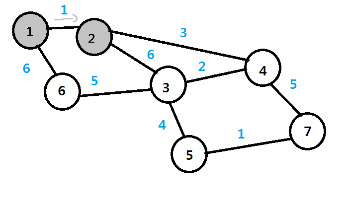

# 다양한 동적 계획법 문제 풀이

### 다이나믹 프로그래밍 적용 개미전사문제

```python
#정수N을 입력받기
n=int(input())
#모든 식량 정보 입력 받기
array=list(map(int,input().split()))

#앞서 계산된 결과를 저장하기 위한 DP테이블 초기화
d=[0]*100

#다이나믹 프로그래밍(Dynamic Programing)진행(보텀업)
d[0]=array[0]
d[1]=max(array[0],array[1])
for i in range(2,n):
    d[i]=max(d[i-1],d[i-2]+array[i])
    
#계산된 결과출력
print(d[n-1])
```

### 1로 만들기

- 정수 X가 주어졌을 때, 정수 X에 사용할 수 있는 연산 4가지
  1. X가 5로 나누어 떨어지면 5로 나눔
  2. X가 3으로 나누어 떨어지면 3으로 나눔
  3. X가 2로 나누어 떨어지면 2로 나눔
  4. X에서 1을 뺌
- 연산 4개를 사용해 값을 1로 만들기
  - 26 -> 25 -> 5 -> 1

```python
#정수 X를 입력 받기
x=int(input())

#앞서 계산된 결과를 저장하기 위한 DP테이블 초기화
d=[0]*30001

#다이나믹 프로그래밍(Dynamic Programming)진행(보텀업)
for i in range(2,x+1):
    #현재의 수에서 1을 빼는 경우
    d[i]=d[i-1]+1
    #현재의 수가 2로 나누어 떨어지는 경우
    if i%2==0:
        d[i]=min(d[i],d[i//2]+1)
    #현재의 수가 3으로 나누어 떨어지는 경우
    if i%3==0:
        d[i]min(d[i],d[i//3]+1)
    #현재의 수가 5로 나누어 떨어지는 경우
    if i%5=0:
        d[i]=min(d[i],d[i//5]+1)
        
print(d[x])
```

### 효율적인 화폐구성

M원을 만들기 위한 최소한의 화폐개수 출력 프로그램 작성

n=100까지 m=10000까지 

```python
#정수 N,M을 입력받기
n,m=map(int,input().split())
#N개의 화폐 단위 정보를 입력받기
array=[]
for i in range(n):
    array.append(int(input()))
    
#한 번 계산된 결과를 저장하기 위한 DP테이블 초기화
d=[10001]*(m+1)

#다이나믹 프로그래밍(Dynamic Programming)진행(보텀업)
d[0]=0
for i in range(n):
    for j in range(array[i],m+1):
        if d[j-array[i]]!=10001:   #(i-k)원을 만든느 방법이 존재하는 경우
            d[j]=min(d[j],d[j-array[i]]+1)
            
#계산된 결과 출력
if d[m]==10001:    #최종적으로 M원을 만드는 방법이 없는 경우
    print(-1)
else:
    print(d[m])
```


# 그리디 알고리즘(탐욕법)

- 현재상황에서 좋은것만 고르는 방법
- 가장 좋아 보이는 것을 반복적으로 선택해도 최적의 해를 구할 수 있는지 검토




### 문제예시 : 루트노드부터 거쳐가는 노드값을 최대로 찾고싶다면?

인접 노드가 가장 큰것만 이동하면 해결 할 수 있다.

``최적의 해``가 되는지가 가장 중요하다.


# 구현 : 많은 연습이 필요하다

### 구현이란, 머릿속에 있는 알고리즘을 소스코드로 바꾸는 과정


- problem - thinking - solution


### 구현 유형의 문제란? 무엇을 의미할까?

- 풀이를 떵로리는 것은 쉽지만, 소스코드로 옮기기 어려운 문제를 지칭함
- 구현유형의 예시
  - 알고리즘은 간단한데 코드가 지나칠만큼 길어지는 문제
  - 실수 연산을 다루고, 특정 소수점 자리까지 출력해야 하는 문제
  - 문자열을 특정한 기준에 따라 끊어서 처리해야 하는 문제
  - 적절한 라이브러리를 찾아서 사용해야 하는 문제


- 일반적으로 알고리즘 문제에서 2차원 공간은 행렬의 의미로 사용됨

열(Column)

───────────>

| (0,0) | (0,1) | (0,2) | (0,3) | (0,4) |
| ----- | ----- | ----- | ----- | ----- |
| (1,0) | (1,1) | (1,2) | (1,3) | (1,4) |
| (2,0) | (2,1) | (2,2) | (2,3) | (2,4) |
| (3,0) | (3,1) | (3,2) | (3,3) | (3,4) |
| (4,0) | (4,1) | (4,2) | (4,3) | (4,4) |

```python
for i in range(5):
    for j in range(5):
        print('(',i,',',j,')',end=' ')
        print()
```

- 시뮬레이션 및 완전탐색 문제에서는 2차원 공간의 ``방향 벡터``가 자주 활용됨

| (0,0) | (0,1) | (0,2) | (0,3) | (0,4) |
| ----- | ----- | ----- | ----- | ----- |
| (1,0) | (1,1) | (1,2) | (1,3) | (1,4) |
| (2,0) | (2,1) | (2,2) | (2,3) | (2,4) |
| (3,0) | (3,1) | (3,2) | (3,3) | (3,4) |
| (4,0) | (4,1) | (4,2) | (4,3) | (4,4) |

- 가장 가운데 (2,2)를 중심으로 동서남북

```python
#동,북,서,남
dx=[0,-1,0,1]
dy=[1,0,-1,0]

#현재 위치
x,y=2,2

for i in range(4):
    #다음 위치
    nx=x+dx[i]
    ny=y+dy[i]
    print(nx,ny)
```


# 투 포인터

- 알고리즘 대회에서 자주 등장하는 내용
- 리스트에 순차적으로 접근해야 할 때 두개의 점의 위치를 기록하면서 처리하는 알고리즘을 의미함


### 구간 합

연속적으로 나열된 N개의 수가 있을 때 ``특정 구간의 모든 수를 합한 값을 계산``하는 문제

- 접두사 합 : Prefix Sum, 배열의 맨 앞부터 특정 위치까지의 합을 미리 구해 놓은 것
- 구간합 빠르게 계산하기

```python
#데이터의 개수 N과 데이터 입력받기
n=5
data=[10,20,30,40,50]

#접두사 합(Prefix Sum) 배열 계산
sum_value=0
prefix_sum=[0]
for i in data:
    sum_value +=i
    prefix_sum.append(sum_value)
    
#구간 합 계산(세번째 수부터 네번째 수까지)
left=3
right=4
print(prefix_sum[right]-prefix_sum[left-1])
```

