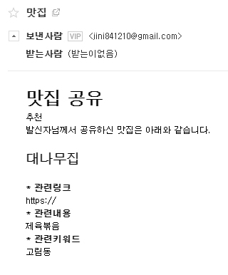

- 가상공간 작동 명령

$ conda activate ``가상설정 폴더``

- 서버 실행

$ python manage.py runserver

- e-mail setting
  - settings.py

```python
# Email settings
EMAIL_BACKEND = 'django.core.mail.backends.smtp.EmailBackend'
EMAIL_HOST = 'smtp.gmail.com'
EMAIL_USE_TLS = True
EMAIL_PORT = 587
EMAIL_HOST_USER = 'jini841210@gmail.com'    #서버(현재컴퓨터)에서 로그인 되어있는 계정
EMAIL_HOST_PASSWORD = '*************'    #비밀번호
```

- sendEmail/views.py

```python
def sendEmail(request):
    try:
        checked_res_list=request.POST.getlist('checks')
        inputReceiver=request.POST['inputReceiver']
        inputTitle=request.POST['inputTitle']
        inputContent=request.POST['inputContent']

        print(checked_res_list,'/',inputReceiver,'/',inputTitle,'/',inputContent)
        restaurants=[]

        for checked_res_id in checked_res_list:
            restaurants.append(Restaurant.objects.get(id=checked_res_id))

        content={'inputContent':inputContent,'restaurants':restaurants}
        msg_html=render_to_string('sendEmail/email_format.html',content)
        print(msg_html)
        msg = EmailMessage(subject = inputTitle, body=msg_html, from_email="jini841210@gmail.com", bcc=inputReceiver.split(','))
        msg.content_subtype = 'html'
        msg.send()


        return render(request,'sendEmail/sendSuccess.html')
    except:
        return render(request,'sendEmail/sendFail.html')
```

- e-mail보내기 할 때 사용할 이메일은 반드시 서버로 사용하는 컴퓨터에서 로그인 되어있는  google 계정이어야 한다.
- 해당 e-mail계정은 2차보안이 설정되어 있지 않고, ``보안 수준이 낮은 앱의 액세스``가 허용되어 있어야 한다.

- 결과화면



