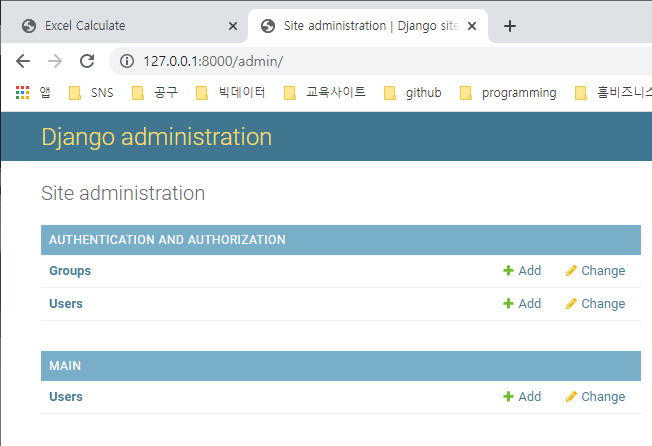
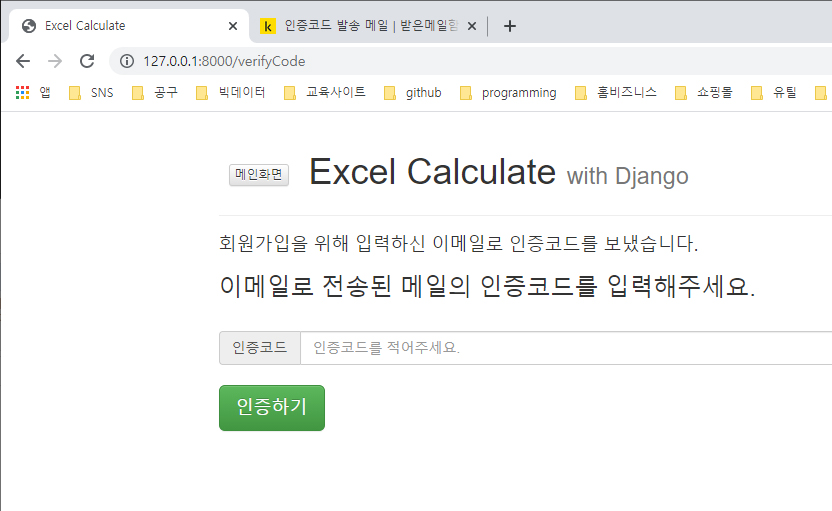
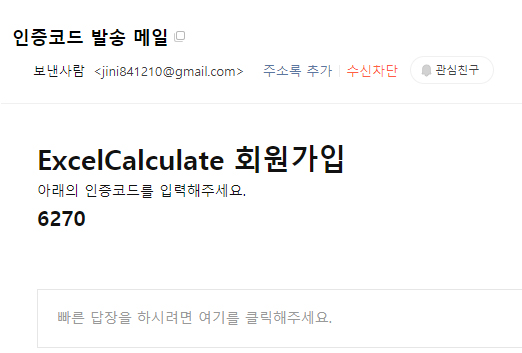
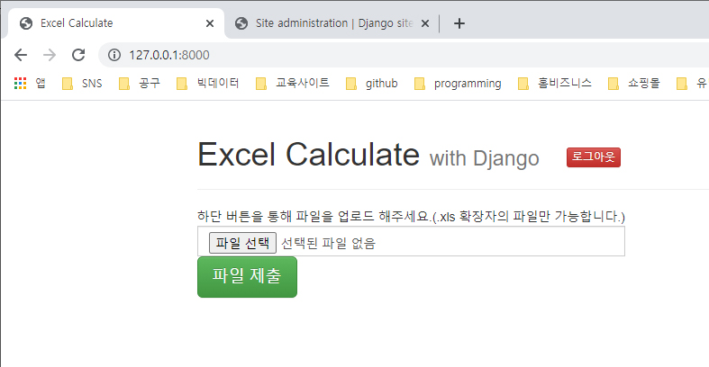

폴더 만들기
ExcelCalculate-with_Django

File > Opne Folder(위에 만든 폴더 선택)

Ctrl + ` (terminal 실행)

#가상환경 생성
$ conda create -n excelEnv python=3.8.8 anaconda

#가상환경 활성화
$ conda activate excelEnv

# django 설치
$ conda install django

#프로젝트 생성
$ django-admin startproject ExcelCalculate

#프로젝트 폴더로 이동
$ cd ExcelCalculate

# 3개의 app 생성
$ python manage.py startapp main
$ python manage.py startapp sendEmail
$ python manage.py startapp calculate

# ExcelCalculate > ExcelCalculate > settings.py에서 INSTALLED_APPS에 앱을 추가한다.
    'main',
    'sendEmail',
    'calculate',


# gmail 계정 관리> 보안> 보안 수준이 낮은 앱의 액세스 '사용' 

# 다운로드 받은 main_templates.zip 파일 압출해제해서
C:\study\ExcelCalculate-with_Django\ExcelCalculate\main 폴더 아래에 
templates 폴더 째 넣는다.

# ExcelCalculate > urls.py 수정
######################
from django.contrib import admin
from django.urls import path, include

urlpatterns = [
    path('', include('main.urls'), name='main'),
    path('admin/', admin.site.urls),
]
######################

# main > urls.py 생성
######################
from django.urls import path
from . import views

urlpatterns = [
    path('', views.index, name='main_index'),
]
######################

# main > views.py 수정
######################
from django.http.response import HttpResponse
from django.shortcuts import render, redirect
from django.urls import reverse
from django.http import HttpResponse
from random import *
from .models import *
from sendEmail.views import *
import hashlib


# Create your views here.
def index(request):
    return HttpResponse('index')
######################

# 서버실행 확인
$ python manage.py runserver

# chrom을 실행한 다음 아래 주소를 입력해서 확인
http://127.0.0.1:8000/


++++++++++++++++++++++++++++++++++++++++++
# main > views.py  수정
######################
from django.http.response import HttpResponse
from django.shortcuts import render, redirect
from django.urls import reverse
from django.http import HttpResponse
from random import *
from .models import *
from sendEmail.views import *
import hashlib

# Create your views here.
def index(request):
    if 'user_name' in request.session.keys():
        return render(request, 'main/index.html')
    else:
        return redirect('main_signin')

def signup(request):
    return render(request, 'main/signup.html')

def join(request):
    print(request)
    name = request.POST['signupName']
    email = request.POST['signupEmail']
    pw = request.POST['signupPW']
    # pw encryption
    encoded_pw = pw.encode()
    encrypted_pw = hashlib.sha256(encoded_pw).hexdigest()
    user = User(user_name = name, user_email = email, user_password = encrypted_pw)
    user.save()
    code = randint(1000, 9999)
    response = redirect('main_verifyCode')
    
    response.set_cookie('code',code)
    response.set_cookie('user_id',user.id)
    # 이메일 발송 함수 호출
    send_result = send(email,code)
    print('send_result=', send_result)
    if send_result:
    
        return response
    else:
        content = {'message':'이메일 발송에 실패하였습니다.'}
        return render(request, 'main/error.html',content)
        # return HttpResponse("이메일 발송에 실패하였습니다.")

def signin(request):
    return render(request, 'main/signin.html') 

def login(request):
    return HttpResponse('login')    

def loginFail(request):
    return HttpResponse('loginFail')    

def logout(request):
    return HttpResponse('logout')

def verifyCode(request):
    return render(request, 'main/verifyCode.html')

def verify(request):
    return HttpResponse('verify')

def result(request):
    return HttpResponse('result')
######################

# main > urls.py 수정
######################
urlpatterns = [
    path('', views.index, name='main_index'),
    path('signup', views.signup, name='main_signup'),
    path('signup/join', views.join, name='main_join'),
    path('signin', views.signin, name='main_signin'),
    path('signin/login', views.login, name='main_login'),
    path('loginFail', views.loginFail, name='main_loginFail'),
    path('verifyCode', views.verifyCode, name='main_verifyCode'),
    path('verify', views.verify, name='main_verify'),
    path('result', views.result, name='main_result'),
    path('logout', views.logout, name='main_logout')
]
######################

# signup.html 수정 - 회원가입하기 action추가

```html
<form action="signup/join" method="POST" id="signup-form">
```
으로 수정해준다.

# main > models.py 에 추가 ( User table)
######################
class User(models.Model):
    user_name = models.CharField(max_length = 20)
    user_email = models.EmailField(unique=True)
    user_password = models.CharField(max_length = 100)
    user_validate = models.BooleanField(default=False)
######################

$ python manage.py makemigrations

$ python manage.py migrate  


# 관리자 페이지 설정을 위해 superuser 생성

$ python manage.py createsuperuser
Username: root
Email address: (입력안함, 엔터)
Password: a1234
Password (again): a1234
This password is too short. 블라블라~ : y입력

- superuser 창



#서버 실행
python manage.py runserver

# 확인
http://127.0.0.1:8000/admin/
root/a1234 넣어서 관리자 로긴 확인


# ExcelCalculate > ExcelCalculate > settings.py 에서
# ALLOWED_HOSTS = [] 뒤에 코드 추가
######################
# Email settings
EMAIL_BACKEND = 'django.core.mail.backends.smtp.EmailBackend'
EMAIL_HOST = 'smtp.gmail.com'
EMAIL_USE_TLS = True
EMAIL_PORT = 587
EMAIL_HOST_USER = '본인메일계정@gmail.com'
EMAIL_HOST_PASSWORD = '본인메일계정패스워드입력'
######################
# MIDDLEWARE=[]에 'django.contrib.sessions.middleware.SessionMiddleware' 있는지 확인
# INSTALLED_APPS = []에 'django.contrib.sessions', 있는지 확인
# 없으면 둘 다 추가할 것
# session은 client와 server의 연결을 유지시켜주는 역할을 함.
#파일 마지막에 첨부파일 처리를 위해 코드 추가
######################
# Media files
MEDIA_ROOT = os.path.join(BASE_DIR, 'media')
MEDIA_URL = '/media/'
######################
+++++++++++++++++++++++++++++++++++++++++++++++


# main > admin.py 수정
######################
from django.contrib import admin
from .models import *

# Register your models here.
admin.site.register(User)
######################

# http://127.0.0.1:8000/ 회원가입하기 >정보입력 >가입하면 아직은 오류가 뜸.
# http://127.0.0.1:8000/admin/ 에서 MAIN의 User 테이블 클릭해서 정보 확인해 볼 수 있음.
# 일단 User테이블 정도 다 지우고 초기화 해둠.


# sendEmail > urls.py 생성
######################
from django.urls import path
from . import views

urlpatterns = [
    path('send', views.send, name='email_send'),
]
######################

# sendEmail > views.py 수정
######################
from django.shortcuts import render
from django.http import HttpResponse
from django.core.mail import send_mail, EmailMessage
from django.template.loader import render_to_string

# Create your views here.
def send(receiverEmail, verifyCode):
    try:
        content = {'verifyCode':verifyCode}
        msg_html = render_to_string('sendEmail/email_format.html',content)
        msg = EmailMessage(subject="인증코드 발송 메일",body=msg_html,from_email="본인메일계정@gmail.com",bcc=[receiverEmail])
        msg.content_subtype='html'
        msg.send()
        return True
    except:
        return False
######################

# 다운로드 받은 sendEmail_templates.zip 파일 압축해제해서 C:\study\ExcelCalculate-with_Django\ExcelCalculate\sendEmail 폴더 아래에 
templates 폴더 째 넣는다.


- 회원가입시 인증코드 받으라는 창




- 인증코드 결과



- 파일전송창



