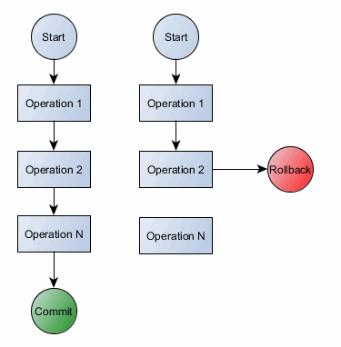

```mysql
SELECT buyprice,
       row_number() OVER(ORDER BY buyprice) AS rownumber,
	   rank() over(ORDER BY buyprice) AS rnk,
	   dense_rank() over(ORDER BY buyprice) AS denserank
FROM products;

# subquery
/*
1. subquery는 ()내에서 작성한다.
2. in : subquery의 결과가 여러개 일 때
   =, >=, <= : subquery의 결과가 1개 이하일 때
*/

SELECT customernumber
FROM customers;   # 125, 169, 206, 223 ....

SELECT ordernumber
FROM orders
WHERE customerNumber=(
                      SELECT customernumber
                      FROM customers
                      WHERE customernumber=103);

SELECT customernumber
FROM customers
WHERE city='NYC';

SELECT ordernumber
FROM orders
WHERE customerNumber in (
                         SELECT customernumber
						 FROM customers
                         WHERE city='NYC');		

#table 생성
create table dept(
  num int(3),
  dname varchar(50),
  dloc varchar(30)
);


#데이터 추가
INSERT INTO dept(num,dname,dloc)
VALUES(10, 'sales','seoul');

INSERT INTO dept
VALUES(20,'human','inchon');

INSERT INTO dept
VALUES(30,Null,NULL);

INSERT INTO dept(num,dloc)
VALUES(40,'busan');

# 수정
UPDATE dept
SET dname='management', dloc='gangneung'
WHERE num=30;

#삭제
DELETE FROM dept
WHERE num=40;


SELECT * FROM dept;

#DB생성 - CREATE DATABASE
SHOW DATABASES;

CREATE DATABASE shop;

use shop;

CREATE TABLE person(
id int(10) primary key,
name varchar(3),
age int(3));

INSERT INTO person(id,name,age)
VALUES(10,'홍길동',40);

INSERT INTO person(id,name,age)
VALUES(20,'유대위',35);

INSERT INTO person(id,name,age)
VALUES(30,'고수',45);

SELECT * FROM person;

SELECT schema_name,default_character_set_name
FROM information_schema.schemata;

ALTER DATABASE shop DEFAULT CHARACTER SET utf8;
ALTER SCHEMA shop DEFAULT COLLATE utf8mb4_general_ci;

ALTER TABLE shop.person
CHARACTER SET=utf8;


UPDATE person
SET age=30
WHERE id=20;

SELECT * FROM person;

### 날짜함수
SELECT now(), curdate(), current_date, current_date();

# yyyy-mm-dd 형태를 yyyymmdd인 숫자형태로 출력
SELECT curdate(),curdate()+0,curdate()+1;

# 날짜 사이의 일수 알기
SELECT datediff(curdate(),'2021-06-02');

#해당 일자의 연도 리턴
SELECT year(curdate());
#해당일자의 월 리턴
SELECT month(curdate());
#해당일자의 일 리턴
SELECT day(curdate());
#해당일자의 요일 리턴
SELECT weekday(curdate());    #월:0, 화:1,....일:7
SELECT dayofweek(curdate());   #일:1, 월:2, 화:3...토:7
#일년 중 몇번째 주인지 리턴
SELECT week(curdate());


```

# python에서 mysql 연결해서 작업하기

```python
#mysql설치 - anaconda에서 실행 할 때
!pip install pymysql

import pymysql   #mysql을 import한다.
```

```python
#아래 내용으로 mysql에 접속한다.
#접속할 ip가 있으면 'localhost'에 ip주소를 입력하고, 해당 passwd도 입력한다.
#불러올 db명까지 입력하면 접속됨

#local ip : 127.0.0.1
conn=pymysql.connect(host='localhost',port=3306, user='root', passwd='a1234',db='classicmodels')
cur=conn.cursor()
```

```python
#sql문을 적을때 'sql='을 쓰고 구문을 적어준다.
sql='SELECT * FROM customers'

#execute():단일성 입력(하나의 레코드 입력)
#executemany():배치 처리(여러개의 레코드 입력)
cur.execute(sql)
cur.executemany(sql, data)
```




```python
conn.commit()
```

- 데이터 갱신할 때 넣어주지 않으면 중간에 명령을 수행하다가 접속이 끊어져버리게 된다.
- <u>**반드시 python에서 sql명령을 적어주고 컬럼값을 변경 적용해야 할 때 써줘야 한다.**</u>

```python
conn.close()
```

- <u>**콘솔을 불러왔으면 반드시 닫아준다고 써준다.**</u>
- <u>**개발자들이 필수적으로 센스있게 해주면 좋다**</u>
- <u>**서버관리자 야근시키지 말자!**</u>

