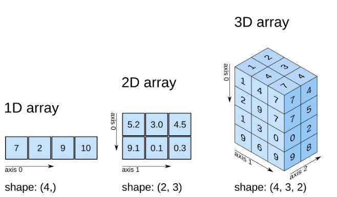

# numpy

- NumPy는 Numerical Python의 줄임말로, 파이썬에서 산술 계산을 위한 가장 필수 패키지중 하나이다.
- 과학 계산을 위한 대부분의 패키지는 NumPy의 배열 객체를 데이터 교환을 위한 공통 언어처럼 사용한다.
- 효율적인 다차원 배열인 ndarray(n dimensional array)는 빠른 배열 계산과 유연한 브로드캐스팅 기능을 제공한다.
- 반복문을 작성할 필요 없이 전체 데이터 배열을 빠르게 계산할 수 있는 표준 수학 함수이다.
- 배열 데이터를 디스크에 쓰거나 읽을 수 있는 도구와 메모리에 적재된 파일을 다루는 도구이다.
- 선형대수, 난수 생성기등에 사용된다.
- C, C++, 포트란으로 작성한 코드를 연결할 수 있는 C API가 제공된다.

==============================================================================


### numpy 호출하기

```python
import numpy as np
```


- 1차원 배열 - 벡터
- 2차원 배열 - 행렬

```python
np.array()
```

- ndarray - n차원의 배열


파이썬과 넘파이에서 사용하는 배열의 구조``(a=[1,2,3])``가 같다.

**헷갈리면 꼭 ``type()`` 으로 확인해보자.**


- identity는 값 하나만 지정할 수 있다.

```python
identity(3)
```

- _like는 기존의 배열 크기 그대로 생성이 된다.

- len은 배열에 있는 요소를 가져온다.
- dtype은 데이터타입
- python의 도움말 - ?_ / shift+tab(jupyter) / np.lookfor(numpy) / help(__)


- n.dim은 몇 차원인지 알려준다
- size는 요소의 갯수를 알려준다
- itmsize는 요소당 byte수를 알려준다.


- **<u>값이 커지면 커질수록 python보다 numpy가 속도가 빠르다.</u>**


1차원일때 copy하면 deepcopy가 이루어진다

2차원일때 copy하면 shallow copy가 이루어져서 값을 가져온다.

```python
import copy
```


- indexing,slicing을 이용해 값을 가져오는것이 가능하다.
- array는 mutable, homogeneous이다.


numpy

```python
print(b[0,2])
```

python

```python
print(a[0][2])
```


numpy에서 boolean indexing 조건

- array만 된다.
- numpy True, False로만 구성되어야 한다.
- shape이 맞아야 한다. (개수가 맞을 때만 사용할 수 있다.)


reshape도 arange와 갯수가 맞아야 한다.

```python
arange(100)=reshape(20,5)  # 20*5는 100
```


행렬 곱

| 1,2   [a,b] | 1,2  [e,f] |
| ----------- | ---------- |
| 3,4   [c,d] | 3,4  [g,h] |


```python
1*1+2*3   1*2+2*4    #a*e+b*g   / a*f+b*h
3*1+4*3   3*2+4*4    #c*e+d*g   / c*f+d*h
```

```python
a.shape=(2,3)
b.shape=(2,3)

a@b  #2행3렬 @ 3행 2렬 이여야 오류가 안난다. -> 행과 열이 바뀐후에 실행해야 한다.

---------------------------------------------------------------------------
ValueError                                Traceback (most recent call last)
<ipython-input-79-a832bb91e25d> in <module>
----> 1 a@b

ValueError: matmul: Input operand 1 has a mismatch in its core dimension 0, with gufunc signature (n?,k),(k,m?)->(n?,m?) (size 2 is different from 3)
```

```python
#전치행렬 :  행과 열을 바꾼다
a.T
#shape이 맞으므로 행렬곱 가능
#numpy에서 모양을 바꾸는 것은 아주 중요하다.
a@b.T
```


### <u>axis는 다차원 배열을 연산 할 때 기준이 되는 축이다.</u>




```python
a
array([[ 0,  1,  2,  3],
       [ 4,  5,  6,  7],
       [ 8,  9, 10, 11]])

np.sum(a)
66

np.sum(a,axis=0)  # axis=0 행기준(행마다)
array([12, 15, 18, 21])

np.sum(a,axis=1)  # axis=1 열기준(열마다)
array([ 6, 22, 38])
```

### axis는 3차원 이상에서도 사용할 수 있다.

```python
a=np.arange(24).reshape(2,3,4)

a
array([[[ 0,  1,  2,  3],
        [ 4,  5,  6,  7],
        [ 8,  9, 10, 11]],

       [[12, 13, 14, 15],
        [16, 17, 18, 19],
        [20, 21, 22, 23]]])

a.sum(axis=0)  #공간기준(공간마다)
array([[12, 14, 16, 18],
       [20, 22, 24, 26],
       [28, 30, 32, 34]])

a.sum(axis=1)  #행기준(행마다)
array([[12, 15, 18, 21],
       [48, 51, 54, 57]])

a.sum(axis=2)  #열기준(열마다)
array([[ 6, 22, 38],
       [54, 70, 86]])
```


3차원은 행렬에 공간(깊이)개념이 추가되었다고 생각할 수 있다.
2차원(axis=0,axis=1)   > (x,y)  (행,열)
3차원(axis=0,axis=1,axis=2)   > (x,y,z)  (공간,행,열)

 